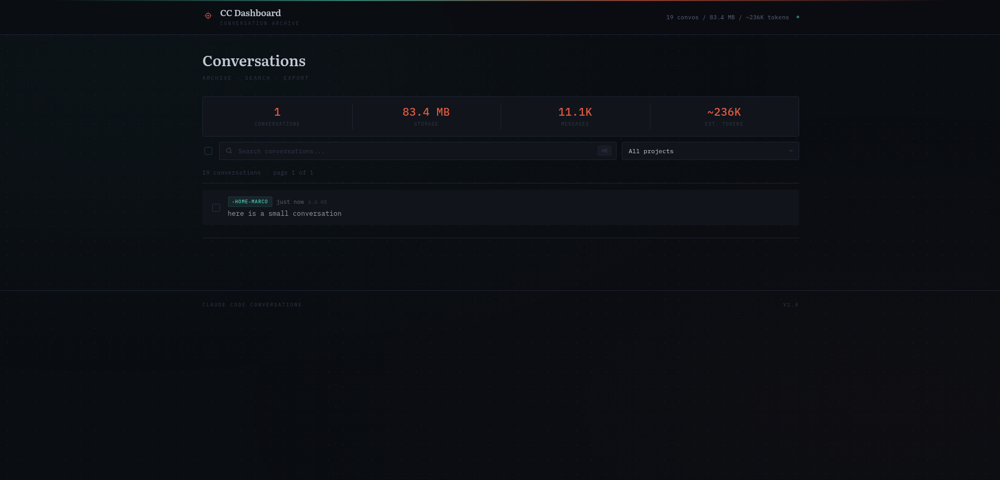
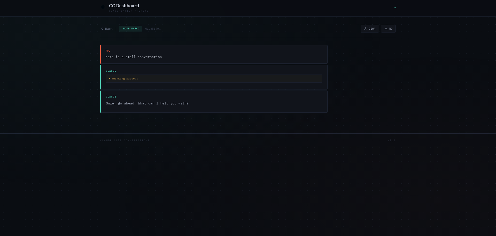

# CC Dashboard

A web dashboard for browsing, searching, and managing [Claude Code](https://docs.anthropic.com/en/docs/claude-code) conversations. Built with Express and EJS, featuring a dark Meridian theme.





## Features

- **Browse conversations** — paginated list with project grouping
- **Search & filter** — full-text search across conversation content, filter by project
- **Select all** — filter-aware bulk selection with "select all matching" mode
- **Bulk delete** — delete selected conversations or all matching a filter in one operation
- **Export** — download conversations as JSON or Markdown
- **Metrics dashboard** — conversation count, storage usage, message count, and estimated token usage
- **Markdown rendering** — assistant responses rendered with full markdown support
- **Thinking blocks** — collapsible thinking process sections
- **Dark theme** — Meridian design with vermillion and teal accents

## Architecture

```
server.js                  → Express app entry point (middleware, routes, error handling)
src/
├── routes/
│   ├── api.js             → REST API endpoints
│   └── pages.js           → Server-rendered page routes
├── services/
│   └── conversations.js   → Business logic (list, get, delete, export, metrics)
├── public/
│   ├── app.js             → Client-side JavaScript
│   ├── marked.min.js      → Self-hosted markdown renderer
│   └── style.css          → Meridian theme styles
└── views/
    ├── _header.ejs        → Shared header partial
    ├── _footer.ejs        → Shared footer partial
    ├── index.ejs          → Conversation list page
    ├── detail.ejs         → Conversation detail page
    ├── 404.ejs            → Not found page
    └── 500.ejs            → Server error page
```

- **Plain JavaScript** (CommonJS) — no TypeScript, no build step
- **Express + EJS** server-rendered views
- **Custom CSS** — no framework dependencies
- **marked.js** self-hosted for Markdown rendering (XSS-safe with custom renderer)
- Reads Claude Code data files from a configurable directory (`CLAUDE_DATA_DIR`)

## Prerequisites

- [Docker](https://docs.docker.com/get-docker/) and [Docker Compose](https://docs.docker.com/compose/install/) (recommended)
- Or: [Node.js 22+](https://nodejs.org/) for local development

## Quick Start (Docker)

```bash
git clone https://github.com/marcs7/Claude-Code-Dashboard.git
cd Claude-Code-Dashboard
cp .env.example .env
# Edit .env — set CLAUDE_HOST_PATH to your ~/.claude directory
docker compose up -d
```

The dashboard will be available at `http://localhost:8502`.

## Local Development

```bash
git clone https://github.com/marcs7/Claude-Code-Dashboard.git
cd Claude-Code-Dashboard
cp .env.example .env
npm install
npm run dev
```

The `dev` script uses `node --watch` for automatic restarts on file changes.

## Configuration

All configuration is managed through environment variables in `.env`:

| Variable | Description | Default |
|---|---|---|
| `APP_PORT` | Port the app listens on | `8502` |
| `CLAUDE_DATA_DIR` | Path to Claude Code data inside the container | `/data/claude` |
| `CLAUDE_HOST_PATH` | Host path to your `~/.claude` directory (Docker volume mount) | — |
| `NODE_ENV` | Environment mode (`production` or `development`) | `production` |
| `FORCE_HTTPS` | Enable HSTS + upgrade-insecure-requests (set `true` behind HTTPS proxy) | `false` |

Copy `.env.example` to `.env` and adjust values for your setup.

## API Reference

| Method | Endpoint | Description |
|---|---|---|
| `GET` | `/api/health` | Health check — returns `{ status: "ok" }` |
| `GET` | `/api/conversations` | List conversations. Query params: `search`, `project`, `page`, `limit` |
| `GET` | `/api/conversations/:project/:sessionId` | Get a single conversation's messages |
| `DELETE` | `/api/conversations/:project/:sessionId` | Delete a single conversation |
| `DELETE` | `/api/conversations/bulk` | Bulk delete. Body: `{ sessionIds?: string[], search?: string, project?: string }` |
| `GET` | `/api/conversations/:project/:sessionId/export` | Export conversation. Query param: `format` (`json` or `md`) |
| `GET` | `/api/metrics` | Aggregated metrics: conversation count, storage, messages, estimated tokens, per-project breakdown |

## Security

- **Path traversal protection** — route parameters validated against strict patterns with defense-in-depth path containment checks
- **XSS prevention** — markdown renderer configured to escape raw HTML
- **Security headers** — helmet with CSP, HSTS (configurable), and standard protections
- **Rate limiting** — DELETE operations capped at 30 req/min per IP
- **Body limits** — 100KB request body limit, bulk delete capped at 200 items per request
- **Non-root container** — runs as `node` user in Docker

## Project Structure

```
Claude-Code-Dashboard/
├── .env.example            # Environment variable template
├── .dockerignore            # Docker build exclusions
├── .github/
│   └── workflows/
│       └── build.yml        # CI workflow (syntax check + Docker build)
├── .gitignore
├── CONTRIBUTING.md
├── LICENSE
├── docker-compose.yml       # Docker Compose service definition
├── Dockerfile               # Multi-stage production build
├── docs/
│   ├── screenshot-list.png
│   └── screenshot-detail.png
├── package.json
├── server.js                # Application entry point
└── src/
    ├── public/
    │   ├── app.js           # Client-side JavaScript
    │   ├── marked.min.js    # Self-hosted markdown renderer
    │   └── style.css        # Meridian theme styles
    ├── routes/
    │   ├── api.js           # API route handlers
    │   └── pages.js         # Page route handlers
    ├── services/
    │   └── conversations.js # Core business logic
    └── views/
        ├── _header.ejs
        ├── _footer.ejs
        ├── index.ejs
        ├── detail.ejs
        ├── 404.ejs
        └── 500.ejs
```

## Contributing

See [CONTRIBUTING.md](CONTRIBUTING.md) for guidelines on how to contribute.

## License

This project is licensed under the MIT License — see the [LICENSE](LICENSE) file for details.
